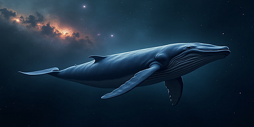

# 🎨 Neural Style Transfer Project

## 📖 Overview
This project implements **Neural Style Transfer (NST)** using pretrained **VGG19** from PyTorch.  
NST blends the **content** of one image with the **style** of another by optimizing the input image to match content and style features extracted from a deep CNN.  

---

## ✨ Features
- Uses **pretrained VGG19** for feature extraction.
- Combines **content and style** images into a new artistic output.
- Adjustable parameters:
  - 🖼️ Image size
  - 🔁 Number of iterations
  - ⚖️ Style weight / Content weight
  - 🎨 Total Variation loss for smoother results
- Live **progress preview** during optimization.
- Option to **download the final stylized image**.
- Deployable via **Streamlit** (local or cloud).

---

# The Gwely`s Neural Style Transfer Explorer :

<p align="center">
  
</p>

---

## 🖼️ Example

### Content Image
<p align="center">
  
</p>


<p align="center">
  
</p>

---

### Style Image

### Stylized Output
<p align="center">
  
</p>

---

<p align="center">
  
</p>


<p align="center">
  
</p>


## 🛠️ Installation

1. Clone the repository:
   ```bash
   git clone https://github.com/your-username/neural-style-transfer.git
   cd neural-style-transfer
   ```


